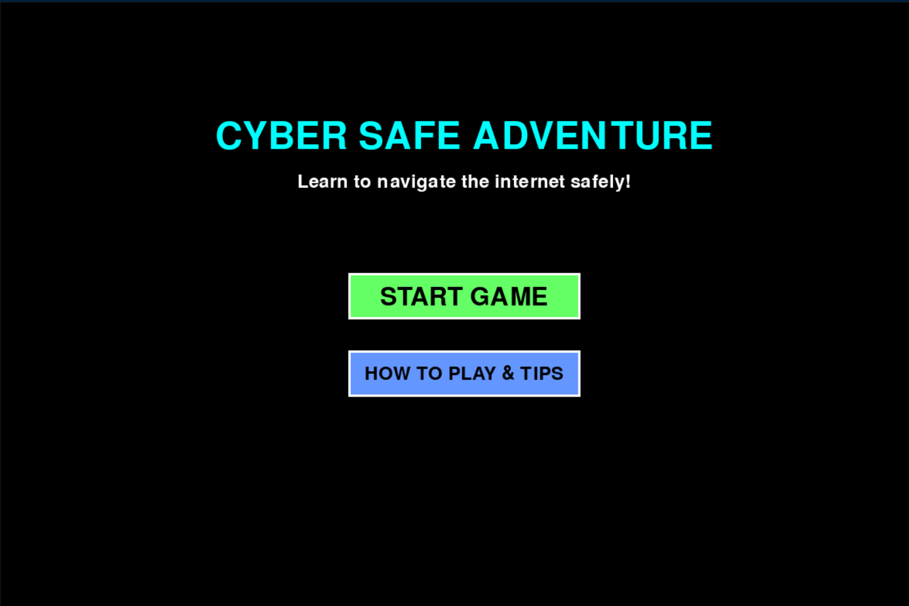
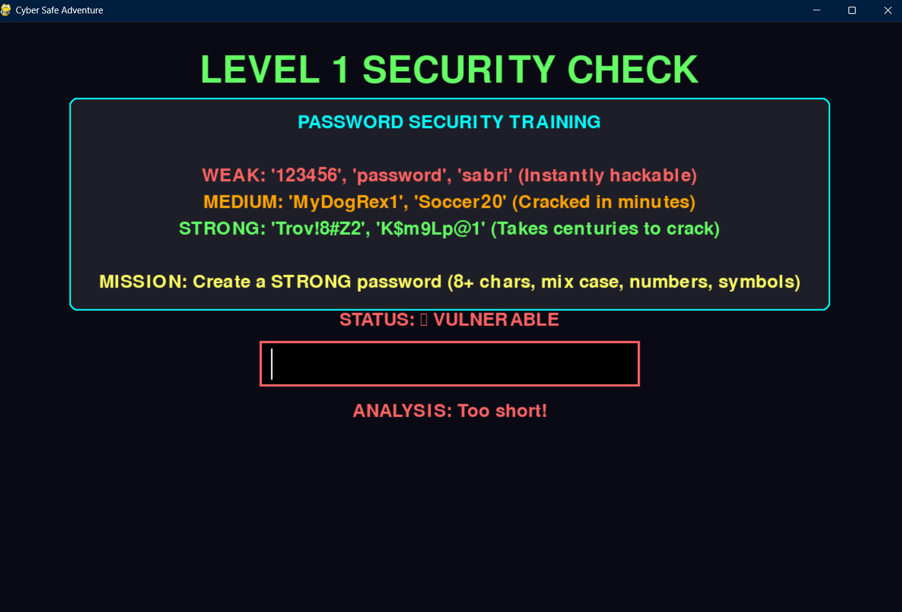
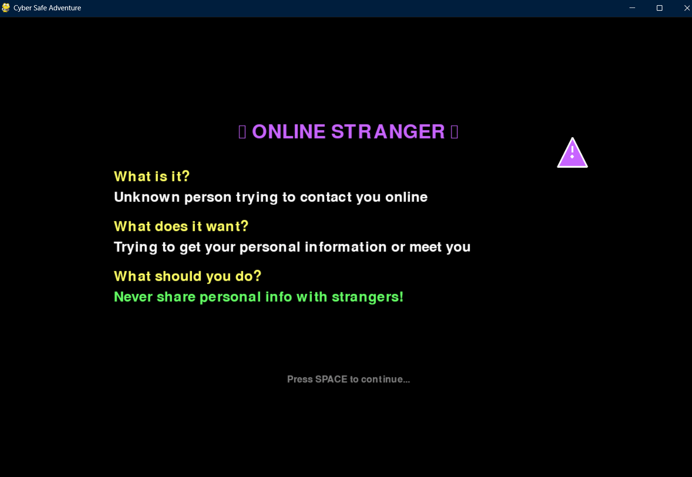
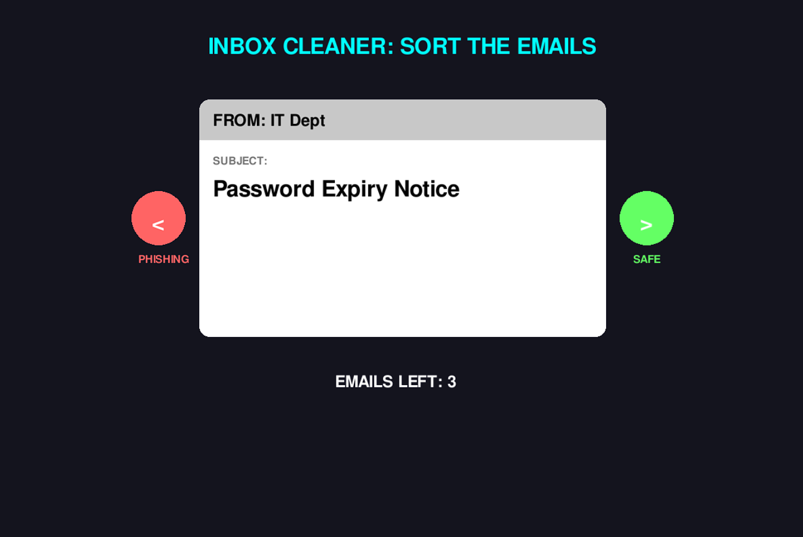
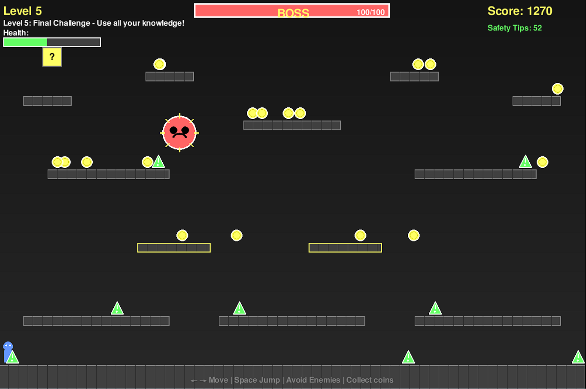
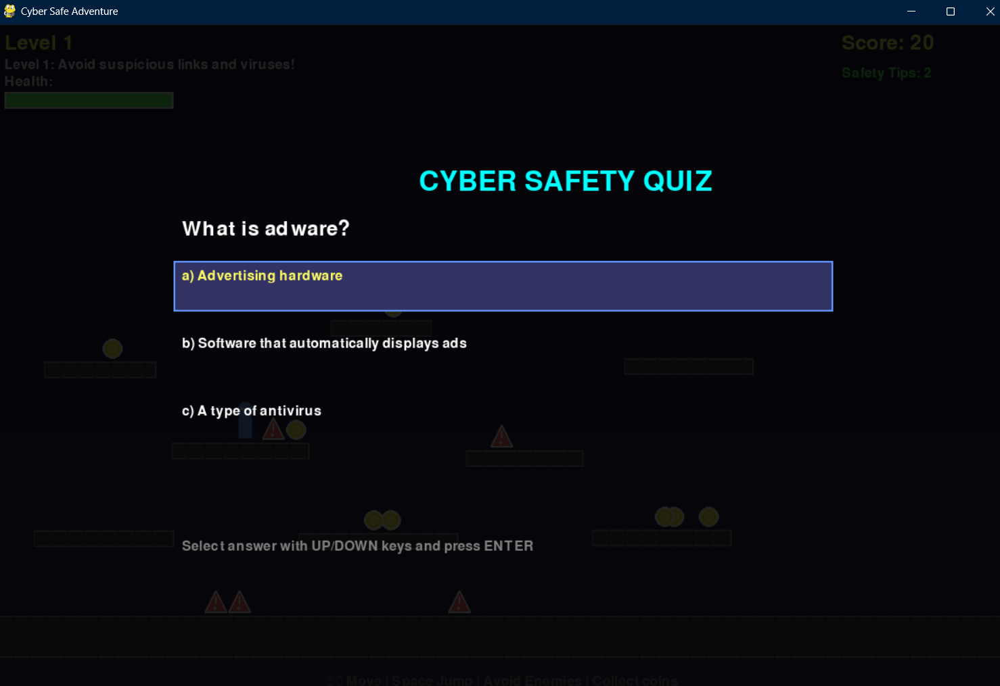

# Cyber Safe Adventure

Cyber Safe Adventure is an educational 2D platformer game built with Python and Pygame. It is designed to teach players, especially children and young students, about internet safety, cybersecurity threats, and best practices in a fun and interactive way. Players navigate through five progressively challenging digital worlds, collecting safety coins, battling viruses, avoiding scams, answering cybersecurity trivia questions, and ultimately defeating the "Master Virus" boss to complete the game.

---

## Git Repository Page

[https://sabriibrahimi.github.io/CyberSafeAdventure/](https://sabriibrahimi.github.io/CyberSafeAdventure/)

## Video Demonstration

[https://drive.google.com/file/d/1sGdJfmwCGrGhcuXSCGfjDa0A_EOE_WA2/view?usp=sharing](https://drive.google.com/file/d/1sGdJfmwCGrGhcuXSCGfjDa0A_EOE_WA2/view?usp=sharing)

---

## Installation and How to Run

1. Make sure you have **Python 3** installed on your system.
2. Install the required library by running the following command in your terminal:
   ```bash
   pip install pygame
   ```
3. Start the game by running:
   ```bash
   python main.py
   ```
   or
   ```bash
   py main.py
   ```

---

## Controls

- **Left Arrow / Right Arrow**: Move the player left or right.
- **SPACE**: Jump. Pressing SPACE again while in the air performs a double jump, allowing the player to reach higher platforms.
- **Up Arrow / Down Arrow**: Navigate through menus and select trivia answer options.
- **ENTER**: Confirm a menu selection or submit a trivia answer.
- **Left Click**: Interact with on-screen buttons and menus.

---

## Game Overview and Start Screen

When the game launches, players are presented with the main menu where they can start a new game, view instructions, or exit. The start screen sets the tone for the adventure with a clear visual introduction to the game world.



The start screen shows the game title, available menu options, and an initial preview of the game environment. From here the player begins their journey through the five levels.

---

## Game Levels and Features

### Level 1: The Infected Network

The first level introduces the player to the core mechanics of the game. The goal is to collect 7 "Safety Coins" scattered across the platforms while avoiding red spike enemies that represent computer Viruses.

- **Goal:** Collect 7 Safety Coins to cleanse the infected network.
- **Enemies:** Viruses represented as red spiked obstacles that patrol the platforms.
- **Challenge:** Basic platforming movement and enemy avoidance.
- **End Challenge:** At the end of the level, the player encounters a Password Security Gate. To unlock Level 2, the player must create a strong password that meets all security requirements: a mix of uppercase and lowercase letters, numbers, symbols, and a minimum of 8 characters.



The password creation screen teaches players what makes a password secure. Visual feedback is given in real time, highlighting which criteria have been met and which are still missing, reinforcing good password habits in an interactive way.

---

### Level 2: Phishing Waters

Level 2 introduces three new enemy types, each representing a different real-world digital threat. This level is designed to educate players about the variety of dangers they may encounter online.

- **Phishing enemies (Blue):** Represent fake emails and fraudulent websites attempting to steal personal information.
- **Malware enemies (Green):** Represent harmful software that can damage a device or steal data when accidentally downloaded.
- **Online Stranger enemies (Purple):** Represent unknown and potentially dangerous contacts online.

A key educational feature introduced in this level is Threat Intelligence. The first time a player touches a new enemy type, the game pauses and displays an Info Card explaining exactly what that type of threat is, how it works in real life, and how to avoid it. After reading the card, the player faces a short trivia question to confirm their understanding before continuing.



The info card screen pauses gameplay and presents a clear explanation of the new threat type encountered. This approach ensures players learn about each threat in the context of encountering it, making the lesson more memorable and impactful.

---

### Level 3: Stranger Danger

Level 3 increases the difficulty by filling the level with Online Stranger enemies and faster-moving Virus enemies. The platform layout becomes more complex, requiring precise jumping and planning.

- **Goal:** Navigate the level from start to checkpoint while avoiding all enemies.
- **Mechanic:** Enemies patrol faster and cover more dangerous platform combinations, demanding greater player awareness and reflexes.

---

### Level 4: Malware Maze

Level 4 presents the most intense enemy infestation before the final boss. Malware enemies fill the level and move at higher speeds. At the end of this level, before the player can proceed, they must complete the Inbox Cleaner challenge.

- **End Challenge - Inbox Cleaner:** The player is shown 5 incoming emails one by one. For each email, they must decide whether it is a safe legitimate email (press Right Arrow) or a phishing attempt (press Left Arrow). All 5 emails must be sorted correctly to unlock the path to the final level.



The inbox cleaner challenge simulates a real-world scenario where the player must evaluate email content for signs of phishing, such as suspicious sender addresses, urgent language, or requests for personal information. This directly trains a critical skill for safe internet use.

---

### Level 5: The Master Virus (Boss Battle)

The final level is a boss arena where the player faces the Master Virus, a large and intelligent enemy that actively chases the player and launches corruption projectiles. Traditional combat does not work against this boss; the player must use knowledge to defeat it.

- **How to Win:**
  1. Find Question Blocks scattered around the arena and jump into them from below.
  2. Each Question Block triggers a Firewall Quiz with a cybersecurity question.
  3. Answering correctly launches a Counter-Attack that reduces the boss's health.
  4. Survive the boss's attacks while answering enough questions correctly to bring its health to zero.



The boss battle combines all the skills and knowledge the player has gathered throughout the game. The player must stay mobile to avoid projectiles while actively seeking out Question Blocks to trigger quiz challenges. This level reinforces that knowledge and awareness are the most powerful tools against digital threats.

---

## Educational Mechanics

### Trivia Combat System

Throughout every level, touching an enemy triggers a cybersecurity quiz question instead of immediate damage. This system transforms every enemy encounter into a learning opportunity.



When the player touches an enemy, the game pauses and presents a multiple-choice trivia question related to cybersecurity. The player uses the Up and Down arrows to select an answer and presses ENTER to confirm.

- **Correct Answer:** The player takes no damage and receives a temporary invincibility shield. In some cases, the player also regains a small amount of health.
- **Wrong Answer:** The player takes 15 HP of damage and must continue the level more carefully.

Floating text indicators appear on screen to give instant visual feedback, showing messages such as "+5 HP" for healing or "-15 HP" for damage taken.

### Real-World Lessons Covered

The game covers the following cybersecurity topics across all its levels and challenges:

- Creating and using strong passwords.
- Recognizing and avoiding phishing emails and fraudulent websites.
- Understanding what malware is and how it spreads.
- Staying safe when communicating with strangers online.
- Understanding two-factor authentication (2FA).
- Identifying safe versus suspicious email content.
- Using firewalls and security tools as a defense against cyber threats.

---

## Technical Details

The game is built entirely in Python using the Pygame library. All game logic, level design, enemy behavior, UI rendering, and educational content are managed through Python scripts organized inside the `src` directory. The main entry point is `main.py` located in the project root. No additional game engine is required beyond a standard Python 3 installation and the Pygame package.

---

## Team: Cyber Avangers

**Members:**

Sabri Ibrahimi 221554

Hamdi Ademi 221589

---

---

# Cyber Safe Adventure (Македонски)

Cyber Safe Adventure е едукативна 2D платформерска игра изградена со Python и Pygame. Таа е дизајнирана да ги поучи играчите, особено децата и младите ученици, за безбедноста на интернет, сајберзаканите и добрите практики на забавен и интерактивен начин. Играчите се движат низ пет постепено потешки дигитални светови, собирајќи монети за безбедност, борејќи се со вируси, избегнувајќи измами, одговарајќи на прашања за сајбербезбедност и конечно победувајќи го шефот „Главен Вирус" за да ја завршат играта.

---

## Страница на Git Репозиториумот

[https://sabriibrahimi.github.io/CyberSafeAdventure/](https://sabriibrahimi.github.io/CyberSafeAdventure/)

## Видео Демонстрација

[https://drive.google.com/file/d/1sGdJfmwCGrGhcuXSCGfjDa0A_EOE_WA2/view?usp=sharing](https://drive.google.com/file/d/1sGdJfmwCGrGhcuXSCGfjDa0A_EOE_WA2/view?usp=sharing)

---

## Инсталација и Pokretanje

1. Проверете дали имате инсталирано **Python 3** на вашиот систем.
2. Инсталирајте ја потребната библиотека со следната команда во терминалот:
   ```bash
   pip install pygame
   ```
3. Стартувајте ја играта со:
   ```bash
   python main.py
   ```
   или
   ```bash
   py main.py
   ```

---

## Контроли

- **Лева стрелка / Десна стрелка**: Движење на играчот лево или десно.
- **SPACE**: Скок. Притискање на SPACE повторно додека сте во воздухот изведува двоен скок, овозможувајќи достигнување на повисоки платформи.
- **Горна стрелка / Долна стрелка**: Навигација низ менија и избор на одговори на тривија прашања.
- **ENTER**: Потврда на избор во мени или испраќање на одговор на тривија.
- **Лев Клик**: Интеракција со копчиња и менија на екранот.

---

## Преглед на Играта и Почетен Екран

Кога играта се стартува, играчите се среќаваат со главното мени каде можат да започнат нова игра, да ги видат упатствата или да излезат. Почетниот екран го поставува тонот на авантурата со јасен визуелен вовед во светот на играта.


Почетниот екран го прикажува насловот на играта, достапните опции во менито и почетен преглед на игровното опкружување. Оттука играчот ја започнува својата авантура низ петте нивоа.

---

## Нивоа на Играта и Функционалности

### Ниво 1: Заразената Мрежа

Првото ниво го запознава играчот со основните механики на играта. Целта е да се соберат 7 „Монети за Безбедност" расфрлани низ платформите, додека се избегнуваат непријателите со црвени бодли кои претставуваат компјутерски Вируси.

- **Цел:** Собери 7 Монети за Безбедност за да ја исчистиш заразената мрежа.
- **Непријатели:** Вируси претставени како црвени бодливи пречки кои патролираат по платформите.
- **Предизвик:** Основно движење по платформи и избегнување на непријатели.
- **Завршен Предизвик:** На крајот на нивото, играчот наидува на Порта за Безбедност на Лозинка. За да го отклучи Ниво 2, играчот мора да создаде силна лозинка која ги исполнува сите безбедносни барања: мешавина од големи и мали букви, бројки, симболи и минимум 8 знаци.


Екранот за креирање лозинка ги учи играчите што ја прави лозинката безбедна. Визуелен повратен одговор се дава во реално време, истакнувајќи кои критериуми се исполнети и кои сè уште недостасуваат, зајакнувајќи ги добрите навики за лозинки на интерактивен начин.

---

### Ниво 2: Фишинг Води

Ниво 2 воведува три нови типови непријатели, секој претставувајќи различна реална дигитална закана. Ова ниво е дизајнирано да ги едуцира играчите за разновидноста на опасностите со кои можат да се сретнат онлајн.

- **Фишинг непријатели (Сини):** Претставуваат лажни имејли и измамнички веб-сајтови кои се обидуваат да украдат лични информации.
- **Малвер непријатели (Зелени):** Претставуваат штетен софтвер кој може да оштети уред или да украде податоци кога случајно се преземе.
- **Непријатели - Онлајн Странци (Виолетови):** Претставуваат непознати и потенцијално опасни контакти онлајн.

Клучна едукативна функција воведена во ова ниво е Разузнавање на Закани. Кога играчот за прв пат допира нов тип непријател, играта се паузира и прикажува Информативна Картичка со детално објаснување за тоа каква е таа закана, како функционира во реалниот свет и како да се избегне. По читањето на картичката, играчот се соочува со кратко тривија прашање за потврда на разбирањето пред да продолжи.


Екранот со информативна картичка ја паузира играта и претставува јасно објаснување за новиот тип закана. Овој пристап гарантира дека играчите учат за секоја закана во контекст на нејзиното среќавање, правејќи ја лекцијата попамтлива и повлијателна.

---

### Ниво 3: Опасност од Странци

Ниво 3 ја зголемува тежината со полнење на нивото со непријатели - Онлајн Странци и побрзо движечки Вирус непријатели. Распоредот на платформите станува посложен, барајќи прецизно скокање и планирање.

- **Цел:** Навигирај низ нивото од почеток до контролна точка избегнувајќи ги сите непријатели.
- **Механика:** Непријателите патролираат побрзо и покриваат поопасни комбинации на платформи, барајќи поголема свесност и рефлекси од играчот.

---

### Ниво 4: Лавиринт на Малвер

Ниво 4 претставува најинтензивна инфестација со непријатели пред финалниот шеф. Малвер непријателите го полнат нивото и се движат со поголема брзина. На крајот на ова ниво, пред играчот да може да продолжи, мора да го заврши предизвикот Чистач на Сандаче.

- **Завршен Предизвик - Чистач на Сандаче:** На играчот му се прикажуваат 5 дојдовни имејли еден по еден. За секој имејл, мора да одлучи дали е безбеден легитимен имејл (притисни Десна Стрелка) или обид за фишинг (притисни Лева Стрелка). Сите 5 имејли мора да бидат правилно разврстани за да се отклучи патот до финалното ниво.


Предизвикот Чистач на Сандаче симулира реален сценарио каде играчот мора да ја процени содржината на имејлите за знаци на фишинг, како сомнителни адреси на испраќачи, итен јазик или барања за лични информации. Ова директно тренира критична вештина за безбедно користење на интернет.

---

### Ниво 5: Главниот Вирус (Битка со Шеф)

Финалното ниво е арена за борба со шеф каде играчот се соочува со Главниот Вирус, голем и интелигентен непријател кој активно го следи играчот и лансира проектили на корупција. Традиционалната борба не функционира против овој шеф; играчот мора да користи знаење за да го победи.

- **Kako да се победи:**
  1. Пронајди Прашални Блокови расфрлани низ арената и скокни во нив оддолу.
  2. Секој Прашален Блок активира Квиз на Заштитен Ѕид со прашање за сајбербезбедност.
  3. Точниот одговор лансира Контра-Напад кој го намалува здравјето на шефот.
  4. Преживеј ги нападите на шефот додека одговараш доволно прашања точно за да го доведеш здравјето до нула.


Битката со шеф ги комбинира сите вештини и знаења кои играчот ги собрал низ целата игра. Играчот мора да останe мобилен за да избегнува проектили додека активно бара Прашални Блокови за да активира квиз предизвици. Ова ниво ја зајакнува поруката дека знаењето и свесноста се најмоќните алатки против дигиталните закани.

---

## Едукативни Механики

### Систем на Тривија Борба

Низ секое ниво, допирот со непријател активира прашање за сајбербезбедност наместо непосредна штета. Овој систем го претвора секое среќавање со непријател во прилика за учење.


Кога играчот ќе допре непријател, играта се паузира и претставува прашање со повеќе одговори поврзано со сајбербезбедноста. Играчот ги користи стрелките горе и долу за избор на одговор и го притиска ENTER за потврда.

- **Точен Одговор:** Играчот не прима штета и добива привремен штит на неранливост. Во одредени случаи, играчот исто така враќа мало количество здравје.
- **Погрешен Одговор:** Играчот прима 15 HP штета и мора да продолжи со нивото попрецизно.

На екранот се прикажуваат лебдечки текстуални показатели за моментален визуелен повратен одговор, прикажувајќи пораки како "+5 HP" за лекување или "-15 HP" за примена штета.

### Покриени Лекции од Реалниот Свет

Играта ги покрива следните теми за сајбербезбедност низ сите свои нивоа и предизвици:

- Креирање и користење на силни лозинки.
- Препознавање и избегнување на фишинг имејли и измамнички веб-сајтови.
- Разбирање на тоа што е малвер и како се шири.
- Безбедно комуницирање со странци онлајн.
- Разбирање на двофакторна автентикација (2FA).
- Идентификување на безбедна наспроти сомнителна содржина на имејли.
- Користење на заштитни ѕидови и безбедносни алатки како одбрана против сајберзакани.

---

## Технички Детали

Играта е изградена целосно во Python со користење на библиотеката Pygame. Целата логика на играта, дизајнот на нивоата, однесувањето на непријателите, рендерирањето на корисничкиот интерфејс и едукативната содржина се управуваат преку Python скрипти организирани во директориумот `src`. Главната влезна точка е `main.py` лоцирана во коренот на проектот. Не е потребен дополнителен игровен двигател освен стандардна инсталација на Python 3 и пакетот Pygame.

---

## Тим: Cyber Avangers

**Членови:**

Sabri Ibrahimi 221554

Hamdi Ademi 221589
